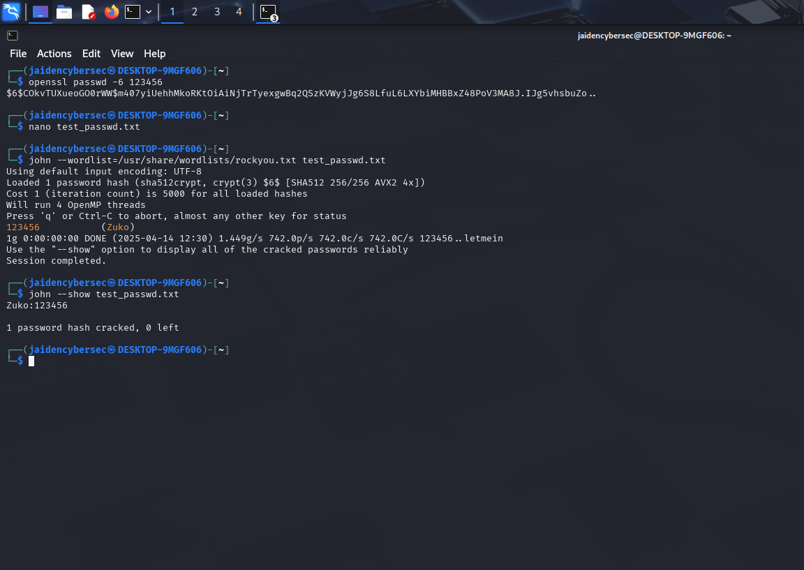

Here’s your upgraded **John the Ripper Walkthrough** with emojis, personal author tag, and polished formatting — perfect for showing off your skills in a professional yet engaging way:

---

# 🔐 John the Ripper Walkthrough  
📜 **Author**: Jaiden Jimerson  
©️ 2025 Jaiden Jimerson. All rights reserved.

This walkthrough documents how I successfully cracked a **SHA-512 password hash** for user `zuko` using **John the Ripper** in **Kali Linux**. 🐉💻

---

## 🧪 Lab: Cracking a SHA-512 Password Hash for User `zuko`

### 🎯 Objective:  
Crack a SHA-512 hashed password that was manually saved into `test_passwd.txt`.

---

### 🛠️ Steps:

1. 🔐 **Generated a SHA-512 password hash** for `123456`:

   ```bash
   openssl passwd -6 123456
   ```

   📥 Example output:
   ```
   $6$randomsalt$u1xN7...restOfTheHash
   ```

---

2. 📂 **Opened `test_passwd.txt` and pasted the hash**:

   ```bash
   nano test_passwd.txt
   ```

   ✏️ Then used:
   - `CTRL + O` to save  
   - `ENTER` to confirm  
   - `CTRL + X` to exit  

---

3. 🚀 **Cracked the password using John the Ripper** with the RockYou wordlist:

   ```bash
   john --wordlist=/usr/share/wordlists/rockyou.txt test_passwd.txt
   ```

---

4. 🧾 **Displayed the cracked credentials**:

   ```bash
   john --show test_passwd.txt
   ```

   ✅ Output:
   ```
   zuko:123456
   ```

---

## 📸 Screenshot  


---

## 📝 Notes  

- 🔑 `openssl passwd -6` creates SHA-512 hashes, the same type found in Linux shadow files.  
- 🧠 John the Ripper **automatically detects the hash format**, so no need to set it manually.  
- 👁️ Use `john --show` to view cracked usernames and their passwords post-attack.

---

Want this turned into a LinkedIn post next?
