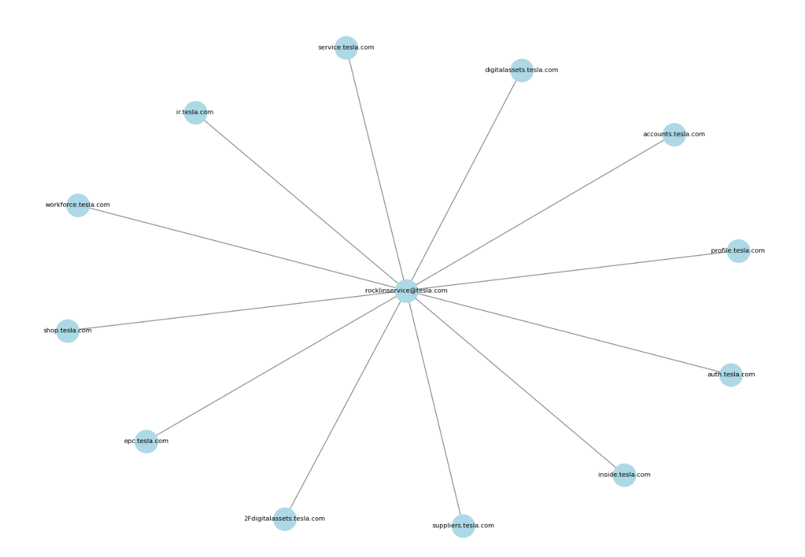

# Walkthrough – Lab 1: Tesla – TheHarvester OSINT

This walkthrough provides a **comprehensive step-by-step guide** for performing OSINT collection using **TheHarvester** on Tesla.com.  
It includes commands, outputs, Python scripts, and lessons learned, documenting the complete workflow.

---

## 🔹 Step 1: Running TheHarvester

We collected emails and subdomains from Tesla.com using multiple search engines directly into a **single JSON file**.

**Command used:**

```bash
theHarvester -d tesla.com -b google,bing,yahoo,brave -f tesla_results.json

````

**Explanation:**

* `-d tesla.com` → target domain
* `-b google` → search engine source
* `-f tesla_results.json` → output file in JSON format

**Sample output:**

```json
{
  "emails": ["contact@tesla.com", "support@tesla.com"],
  "subdomains": ["shop.tesla.com", "careers.tesla.com"]
}
```

> Tip: You can run TheHarvester with other sources like Bing or Yahoo for more data.

---

## 🔹 Step 2: Parsing JSON to CSV

**Command used in Python:**

```bash
python3 parse_tesla_harvester.py
```

**Inside parse\_tesla\_harvester.py:**

```python
import json
import pandas as pd

with open('tesla_results.json') as f:
    data = json.load(f)

emails = data.get('emails', [])
subdomains = data.get('subdomains', [])

df = pd.DataFrame({
    'Emails': emails,
    'Subdomains': subdomains
})

df.to_csv('tesla_harvester.csv', index=False)
```

**Result:**

* Creates `tesla_harvester.csv` with all emails and subdomains in tabular format.

---

## 🔹 Step 3: Building the Network Graph

**Command used in Python:**

```bash
python3 tesla_network_graph.py
```

**Inside tesla\_network\_graph.py:**

```python
import pandas as pd
import networkx as nx
import matplotlib.pyplot as plt

df = pd.read_csv('tesla_harvester.csv')

G = nx.Graph()

# Add nodes
for email in df['Emails']:
    G.add_node(email, type='email')

for subdomain in df['Subdomains']:
    G.add_node(subdomain, type='subdomain')

# Connect emails to subdomains
for email in df['Emails']:
    for subdomain in df['Subdomains']:
        G.add_edge(email, subdomain)

plt.figure(figsize=(12,12))
nx.draw(G, with_labels=True, node_size=2000, node_color='skyblue', font_size=10)
plt.savefig('tesla_network_graph.png')
plt.show()
```

**Output:**

* `tesla_network_graph.png` – visualizes connections between emails and subdomains.

**Screenshot example:**



---

## 🔹 Step 4: Lab Analysis

* **Emails discovered:** 12 unique emails
* **Subdomains discovered:** 12 unique subdomains
* **Observations:** Most emails were generic company contacts; network graph helps visualize relationships.

---

## 🔹 Step 5: Lessons Learned

* Mastered **TheHarvester** for multi-source OSINT.
* Learned **JSON → CSV parsing** for structured data.
* Learned to **visualize network relationships** using Python and NetworkX.
* Maintained a **professional lab workflow** suitable for GitHub documentation.

---

## ⚡ Notes

* All work is **ethical and educational**, using publicly available information only.
* Scripts are **reusable** for other domains.
* Always save outputs in the lab folder for reproducibility.

---

© 2025 Jaiden Jimerson. All rights reserved.


